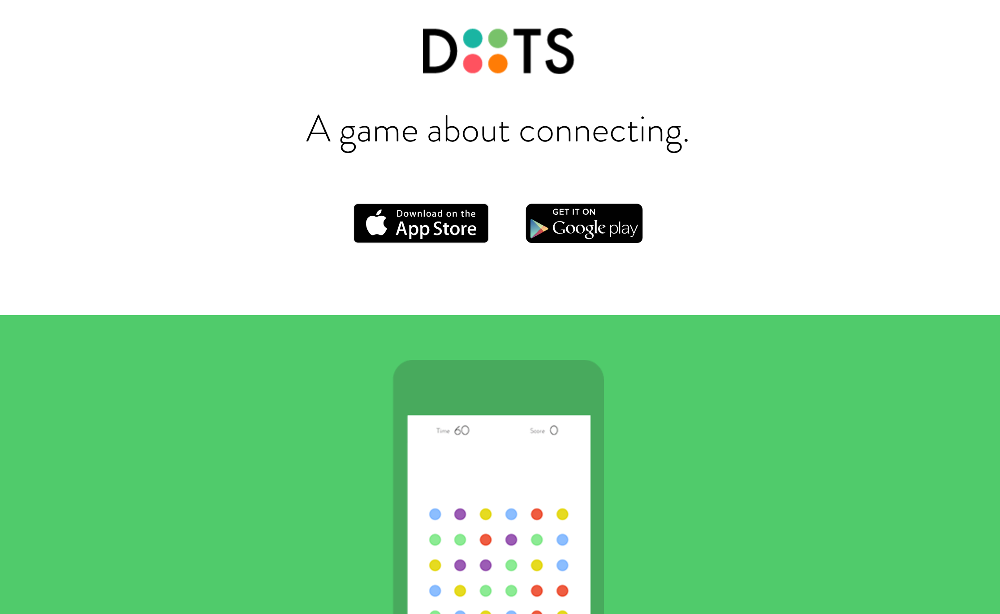
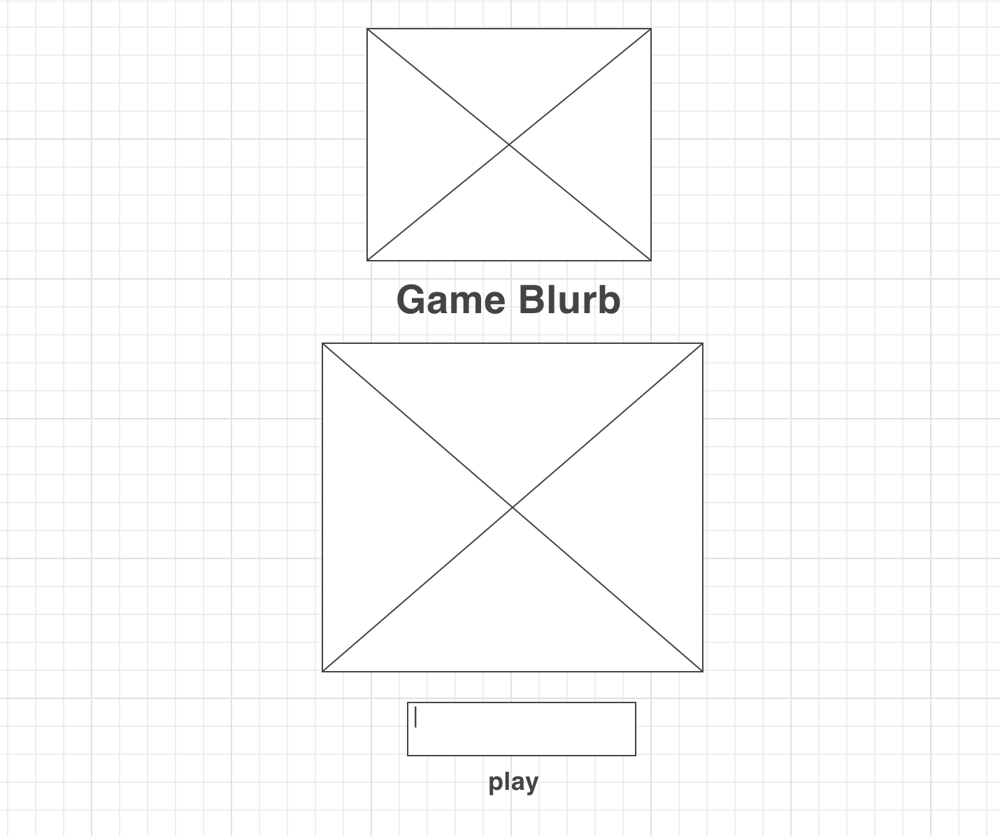
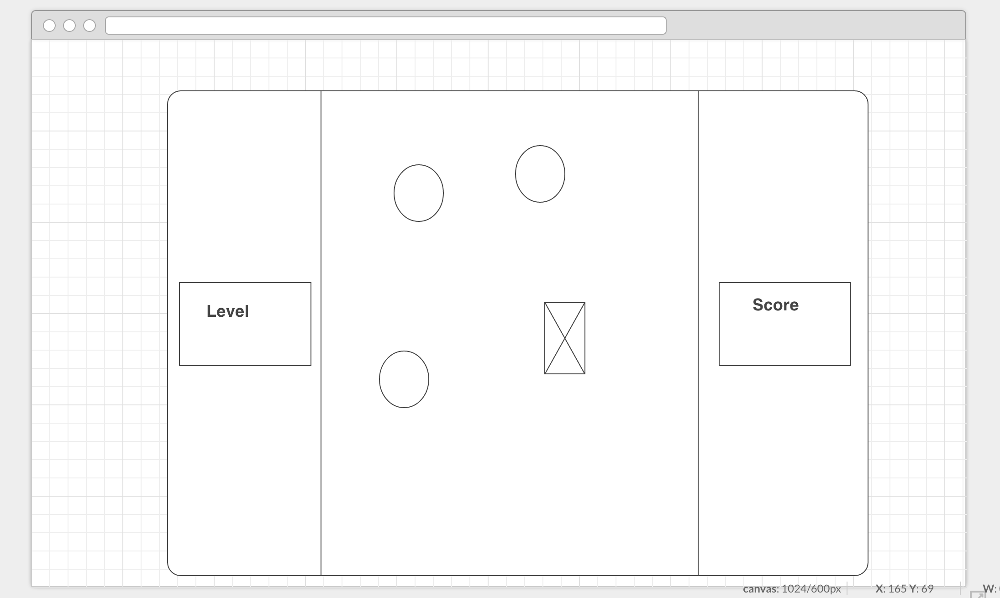
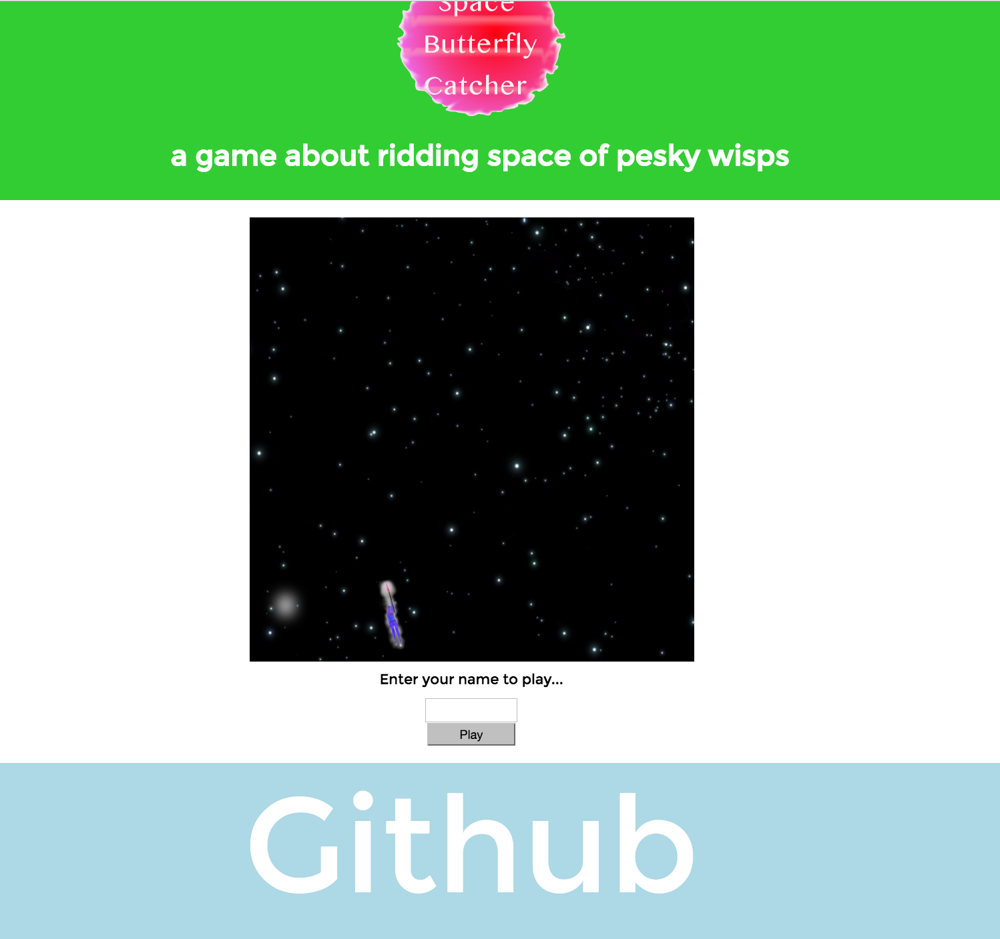
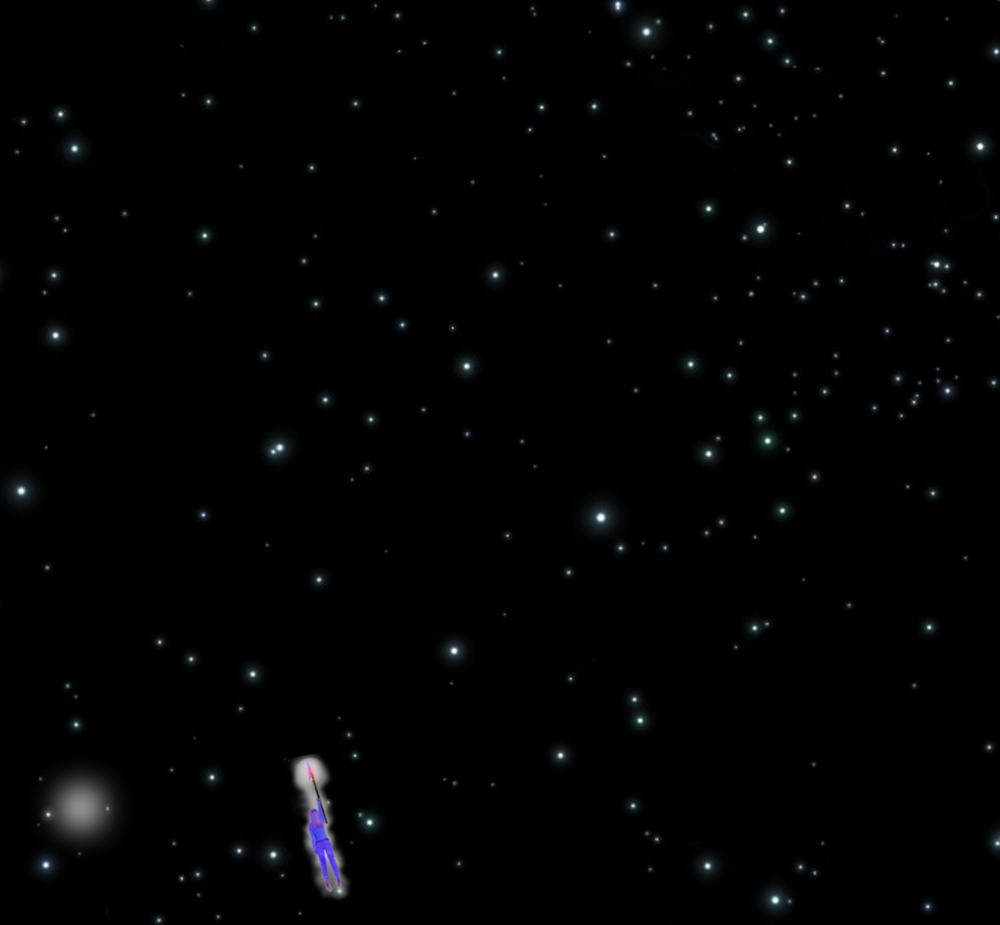

###SPACE BUTTERFLY CATCHER

A game in which the player must fly around a patch of space and spear small wisps of toxic space-dust (lol)

###RULES

If the player is hit by a wisp, they die
If a player touches the edges of space, they are compressed into its vaccuum; they die (do you see an insulated suit?)
If the player skewers a space wisp, they eat +1 wisp kebab for dinner; plus one point

###TECHNOLOGIES USED 

For this project, I only used html, css, javascript and jquery. I found these suitable for creating the game I had in mind. 

###LANDING PAGE REFERENCE
# 

###WIREFRAMES
Landing
# 

Game
# 

####My Game

###Landing

# 

###Game

# 

###Issues

One issue I had with this project was planning to create more features than time allowed. Also, I found that I desperately needed to brush up on trigonometry in order to make hitboxes work.
